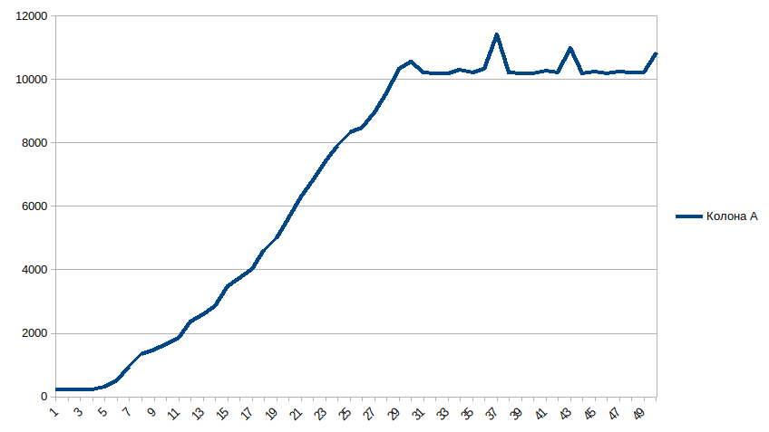
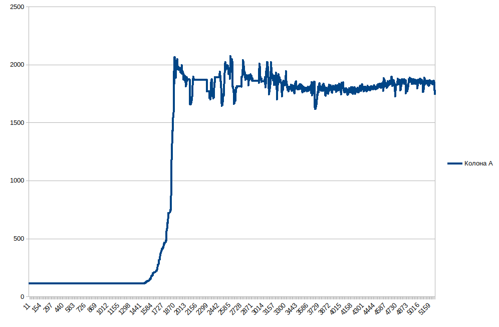

# Fork bomb

- Write a forkbomb program for Linux, Windows
- Make a graph of the number of processes in the OS

---

Fork Bomb in Linux 

Fork Bomb in Windows

---
Fork Bomb is a malicious or incorrectly written program that endlessly creates copies of itself, which usually also start creating copies of themselves, etc. It quickly creates many processes that consume all the computer's resources and do not allow other programs to work. The system becomes inoperable.