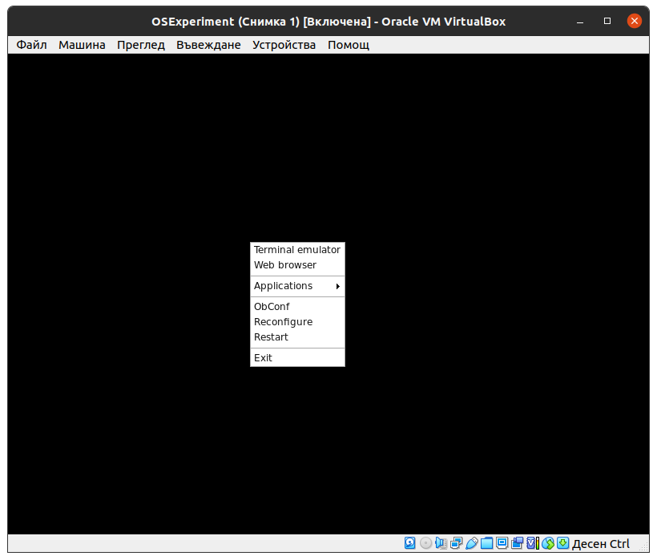
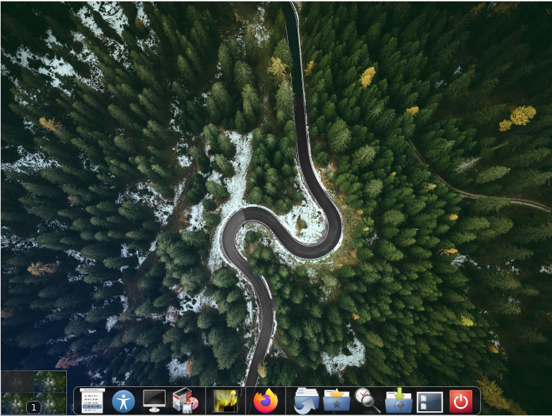
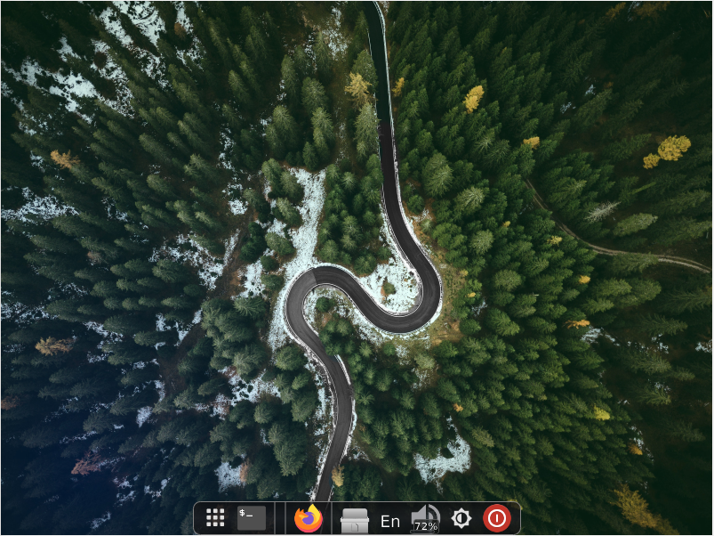
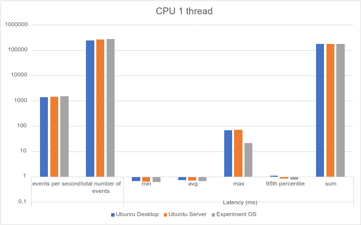
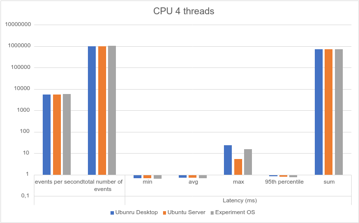
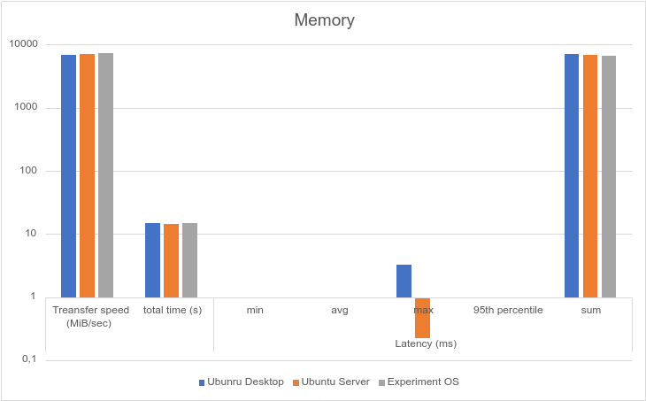
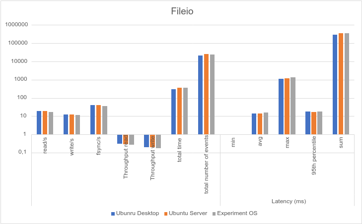
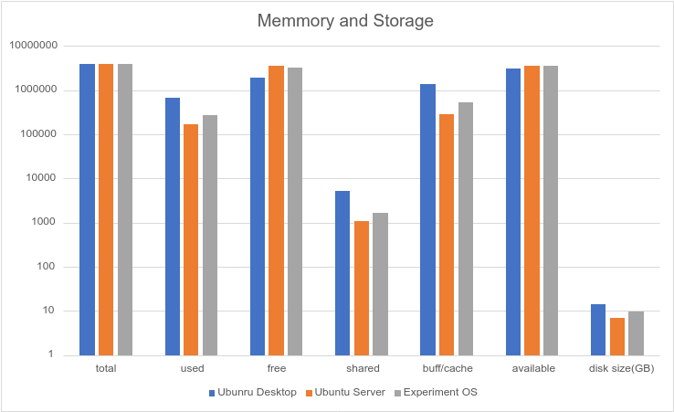

# Minimalistic Linux distribution

- Create a minimalistic Linux distribution for a small laptop based on Ubuntu and compare it with Ubuntu Desktop.

## Server benchmark
After installation on Ubuntu server, we do a standard package update and install sysbench (a benchmark program).

```bash
apt update
apt upgrade
apt install sysbench
```

We restart the machine, write down the size of the OS on the hard drive and how much memory it uses in idle mode, and run the benchmark script.

```bash
du -hc / > first_size.txt 
free > first_memtest.txt
./sysbench_test.sh  > system_benchmark1.txt
```
## Creating a Linux distribution
We install the necessary packages together with the options --no-install-suggests —no-install-recommends, without them all gnome packages are installed, and we don’t want that.

```bash
apt install htop ranger pcmanfm gnome-backgrounds nitrogen openbox obconf lxterminal lxappearance firefox xarchiver synaptic netctl rofi alsa-utils pulseaudio xbacklight xorg xinit xxkb cairo-dock compton --no-install-suggests --no-install-recommends 
```
Since there is no obmenu (menu panel for openbox) in the Ubuntu repository, you need to install it manually.
We download packages via wget and install them via dpkg.

```bash
wget http://no.archive.ubuntu.com/ubuntu/pool/universe/o/obmenu/obmenu_1.0-4_amd64.deb
wget http://no.archive.ubuntu.com/ubuntu/pool/universe/p/pygtk/python-glade2_2.24.0-5.1ubuntu2_amd64.deb
wget http://no.archive.ubuntu.com/ubuntu/pool/universe/p/pygtk/python-gtk2_2.24.0-5.1ubuntu2_amd64.deb
sudo apt install python-cairo
dpkg -i python-gtk2_2.24.0-5.1ubuntu2_amd64.deb
dpkg -i python-glade2_2.24.0-5.1ubuntu2_amd64.deb
dpkg -i obmenu_1.0-4_amd64.deb
```

Launch the graphical interface
`startx`

At the beginning we have only a black screen and a small menu by pressing the right mouse button, but do not be afraid.



We create a file ~/.openbox/autostart.sh and write in it the programs that we want to start when the system boots.


We install new icons and add additional applets to improve the appearance.

```bash
apt install papirus-icon-theame
```


Configuration for working with brightness level adjustment.
`sudo nano /etc/X11/xorg.conf`
```
Section "Device"
    Identifier  "0x42"
    Driver      "intel"
    Option      "Backlight"  "intel_backlight"
EndSection
```
Adding Bulgarian and Russian layouts. Setting up keyboard switching with key combinations win + space, alt + shift
`sudo nano /etc/default/keyboard`
```
# KEYBOARD CONFIGURATION FILE
# Consult the keyboard(5) manual page.

XKBMODEL="pc105"
XKBLAYOUT="us,bg,ru"
XKBVARIANT="basic,phonetic,phonetic"
XKBOPTIONS="grp:win_space_toggle"

BACKSPACE="guess"
```
In /etc/default/grub we change the line     `GRUB_CMDLINE_LINUX_DEFAULT="…"` to `GRUB_CMDLINE_LINUX_DEFAULT="quiet splash"` so that the OS boots without displaying system checks, but only the Ubuntu image.
After that, run the `update-grub` command to apply the changes.

```apt install touchegg```
Touchegg is a program that allows you to extend the capabilities of the touchpad by adding additional gestures that only work under X11.

## Results

<table><thead>
  <tr>
    <th>CPU 1 thread</th>
    <th>events per second</th>
    <th>total number of events</th>
    <th>min</th>
    <th>avg</th>
    <th>max</th>
    <th>95th percentile</th>
    <th>sum</th>
  </tr></thead>
<tbody>
  <tr>
    <td>Ubunru Desktop</td>
    <td>1376.008</td>
    <td>247684.4</td>
    <td>0.648</td>
    <td>0.728</td>
    <td>68.432</td>
    <td>1.096</td>
    <td>179927.262</td>
  </tr>
  <tr>
    <td>Ubuntu Server</td>
    <td>1448.272</td>
    <td>260691.2</td>
    <td>0.624</td>
    <td>0.688</td>
    <td>70.65</td>
    <td>0.844</td>
    <td>179942.658</td>
  </tr>
  <tr>
    <td>Experiment OS</td>
    <td>1528.34</td>
    <td>275103.6</td>
    <td>0.606</td>
    <td>0.656</td>
    <td>21.3</td>
    <td>0.742</td>
    <td>179960.194</td>
  </tr>
</tbody>
</table>

<table><thead>
  <tr>
    <th></th>
    <th></th>
    <th></th>
    <th colspan="5">Latency (ms)</th>
  </tr></thead>
<tbody>
  <tr>
    <td>CPU 4 threads</td>
    <td>events per second</td>
    <td>total number of events</td>
    <td>min</td>
    <td>avg</td>
    <td>max</td>
    <td>95th percentile</td>
    <td>sum</td>
  </tr>
  <tr>
    <td>Ubunru Desktop</td>
    <td>5477.024</td>
    <td>985873.6</td>
    <td>0.67</td>
    <td>0.73</td>
    <td>23.944</td>
    <td>0.838</td>
    <td>719676.564</td>
  </tr>
  <tr>
    <td>Ubuntu Server</td>
    <td>5619.722</td>
    <td>1011559.8</td>
    <td>0.666</td>
    <td>0.71</td>
    <td>5.22</td>
    <td>0.802</td>
    <td>719770.572</td>
  </tr>
  <tr>
    <td>Experiment OS</td>
    <td>5788.134</td>
    <td>1041874.2</td>
    <td>0.656</td>
    <td>0.69</td>
    <td>15.754</td>
    <td>0.754</td>
    <td>719822.538</td>
  </tr>
</tbody>
</table>

<table><thead>
  <tr>
    <th></th>
    <th></th>
    <th></th>
    <th colspan="5">Latency (ms)</th>
  </tr></thead>
<tbody>
  <tr>
    <td>Memory</td>
    <td>Treansfer speed (MiB/sec)</td>
    <td>total time (s)</td>
    <td>min</td>
    <td>avg</td>
    <td>max</td>
    <td>95th percentile</td>
    <td>sum</td>
  </tr>
  <tr>
    <td>Ubunru Desktop</td>
    <td>6947.828</td>
    <td>14.83302</td>
    <td>0</td>
    <td>0</td>
    <td>3.24</td>
    <td>0</td>
    <td>7117.43</td>
  </tr>
  <tr>
    <td>Ubuntu Server</td>
    <td>7127.308</td>
    <td>14.3845</td>
    <td>0</td>
    <td>0</td>
    <td>0.224</td>
    <td>0</td>
    <td>6877.784</td>
  </tr>
  <tr>
    <td>Experiment OS</td>
    <td>7315.7</td>
    <td>14.65334</td>
    <td>0</td>
    <td>0</td>
    <td>0.972</td>
    <td>1282.556</td>
    <td>6713.41</td>
  </tr>
</tbody>
</table>

<table><thead>
  <tr>
    <th></th>
    <th></th>
    <th></th>
    <th></th>
    <th></th>
    <th></th>
    <th></th>
    <th></th>
    <th colspan="5">Latency (ms)</th>
  </tr></thead>
<tbody>
  <tr>
    <td>Fileio</td>
    <td>read/s</td>
    <td>write/s</td>
    <td>fsync/s</td>
    <td>Throughput read</td>
    <td>Throughput write</td>
    <td>total time</td>
    <td>total number of events</td>
    <td>min</td>
    <td>avg</td>
    <td>max</td>
    <td>95th percentile</td>
    <td>sum</td>
  </tr>
  <tr>
    <td>Ubunru Desktop</td>
    <td>19.002</td>
    <td>12.666</td>
    <td>40.742</td>
    <td>0.298</td>
    <td>0.198</td>
    <td>303.14382</td>
    <td>21822.8</td>
    <td>0</td>
    <td>13.754</td>
    <td>1120.936</td>
    <td>17.63</td>
    <td>300116.22</td>
  </tr>
  <tr>
    <td>Ubuntu Server</td>
    <td>18.768</td>
    <td>12.512</td>
    <td>40.202</td>
    <td>0.292</td>
    <td>0.194</td>
    <td>363.19376</td>
    <td>25833</td>
    <td>0</td>
    <td>13.946</td>
    <td>1206.636</td>
    <td>17.32</td>
    <td>360247.706</td>
  </tr>
  <tr>
    <td>Experiment OS</td>
    <td>16.935</td>
    <td>11.285</td>
    <td>36.28</td>
    <td>0.265</td>
    <td>0.175</td>
    <td>363.17975</td>
    <td>23298</td>
    <td>0</td>
    <td>15.465</td>
    <td>1374.81</td>
    <td>17.79</td>
    <td>360203.435</td>
  </tr>
</tbody></table>

<table><thead>
  <tr>
    <th>Memory and Storage</th>
    <th>total</th>
    <th>used</th>
    <th>free</th>
    <th>shared</th>
    <th>buff/cache</th>
    <th>available</th>
    <th>disk size(GB)</th>
  </tr></thead>
<tbody>
  <tr>
    <td>Ubunru Desktop</td>
    <td>4019672</td>
    <td>674888</td>
    <td>1954596</td>
    <td>5304</td>
    <td>1390188</td>
    <td>3057500</td>
    <td>14</td>
  </tr>
  <tr>
    <td>Ubuntu Server</td>
    <td>4025620</td>
    <td>172476</td>
    <td>3564140</td>
    <td>1076</td>
    <td>289004</td>
    <td>3624196</td>
    <td>6.8</td>
  </tr>
  <tr>
    <td>Experiment OS</td>
    <td>4025621</td>
    <td>272240</td>
    <td>3212724</td>
    <td>1664</td>
    <td>540656</td>
    <td>3522968</td>
    <td>9.5</td>
  </tr>
</tbody>
</table>











## Conclusion:
The results show that the Experimental OS has better results than Ubuntu Desktop, and are close to the results of Ubuntu Server. As a result, you should not use such a minimalist OS for the sake of performance, because the results are not that much better, and setting up the OS takes much more time, which is more expensive than saving milliseconds from the PC. But doing and setting up the OS, a person learns a lot about the structure of the system, and the time spent learning something new is not time wasted.