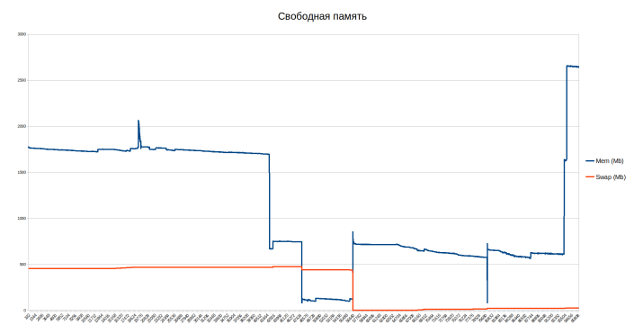

# Membomb

- Write a program to allocate memory and fill it with zeros with a step equal to the size of the memory page (mmap, VirtualAlloc)
- Create a graph of free memory
- Familiarize yourself with the operation of the OOM Killer daemon in Linux
- Reach a message about the impossibility of allocating memory in Windows

## Linux

Process is killed

Graph of free memory in Linux

---
OOM Killer is the kernel's way of solving the problem when there is not enough memory. It is known that virtual memory can be infinitely large (within the addressing limits), but physical memory is a finite number. Sometimes system processes eat it all up, and the system needs to kill someone to continue working. The current implementation of OOM Killer in Linux tries to choose the least important process. It chooses the most bad process among all processes except init and kernel threads.
The algorithm for calculating the level of badness of a process (the final value will be measured in badness points):
1. The size of the virtual memory of the process (total_vm) is taken. These are the base points of badness (mm/oom_kill.c:69).
2. Total_vm/2 + 1 is added to the current points for all spawned processes (mm/oom_kill.c:85).
3. Current points are divided by int_sqrt(cpu_time), where cpu_time is user + system process time shifted to the right by SHIFT_HZ + 3, i.e. for HZ=1000 it will be approximately equal to int_sqrt((utime+stime)/10). Moreover, if the result of division and subsequent rounding is 0, then the points do not change (mm/oom_kill.c:100).
4. Current points are divided by int_sqrt(int_sqrt(run_time/1024)), where run_time is the time elapsed since the process was started. If the result is 0, then the points do not change (mm/oom_kill.c:100).
5. Points are multiplied by 2 if the process nice is greater than 0 (mm/oom_kill.c:118).
6. If the process has the CAP_SYS_ADMIN or CAP_SYS_RESOURCE privilege or (e)uid of zero, then the current points are divided by 4 (mm/oom_kill.c:125).
7. If the process has the CAP_SYS_RAWIO privilege, then the current points are divided by 4 (mm/oom_kill.c:133).
8. If the memory of the process for which we are calculating the unusable points intersects with the memory of the process for which an out of memory error occurred at the time of allocating new memory, then the points are divided by 8 (for kernels older than 2.6.28, mm/oom_kill.c:142).
9. The points collected are multiplied by 2oom_adj, where oom_adj is taken from /proc/$PID/oom_adj, it can take values ​​from -17 to 15. In case of the value -17, the process will not be touched by OOM Killer (mm/oom_kill.c:150).

And the most unsuitable (with the highest points) process will be killed.
A few clarifications.
1. When calculating the child total_vm, only processes with independent virtual memory are taken into account. That is, not threads.
2. It is assumed that if the priority is greater than zero, then the execution of this process is less critical than the execution of processes with a negative priority.
3. It is assumed that root processes are more important than processes of unprivileged users.
4. Killing processes that directly work with devices can lead to undesirable consequences.
5. OOM Killer tends to kill younger processes. This is necessary so that OOM Killer kills the just launched process with a memory leak and does not touch old, good processes that simply eat up a lot of memory
6. OOM Killer tries to save the life of the process for which an out of memory error occurred during memory allocation, and the processes that share memory with it (for kernels older than 2.6.28).

Settings available to the user:
• the easiest way to influence OOM Killer is to use vm.overcommit_memory;
• vm.oom_dump_tasks — dump all processes except kernel threads, the dump includes pid, uid, tgid, vm size, rss, cpu and oom_adj. It makes sense to enable OOM Killer only for debugging;
• vm.oom_kill_allocating_task — kill the process that ran out of memory, without choosing the worst one;
• vm.panic_on_oom — consider the launch of OOM a critical error.

## Windows

ERROR_NOT_ENOUGH_MEMORY (0x8)