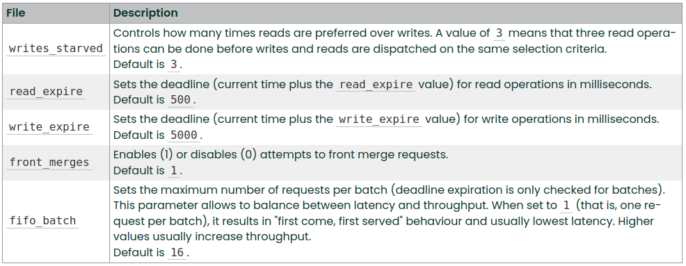

# Scheduler

- Conduct testing and find the best I/O scheduler among others.
- Modify the existing kernel-level scheduler
IO Scheduling https://habr.com/ru/post/81504/

>https://xakep.ru/2014/05/11/input-out-linux-planning/

## Schedulers in my PC
- Deadline is currently the standard scheduler, was developed in 2002. Its operation is based, as is clear from the name, on the deadline — that is, the scheduler tries to execute the request at the specified time. In addition to the usual sorted queue, which appeared in Linus Elevator, it has two more queues — for reading and for writing. Reading again has a higher priority than writing. In addition, requests are combined into batches. A batch is a sequence of read or write requests that goes towards larger sectors ("elevator algorithm"). After processing it, the scheduler looks for write requests that have not been serviced for a long time, and depending on this, decides whether to create a read or write batch.
- BFQ (Budget Fair Queueing) is a relatively new scheduler. Based on CFQ. Without going into technical details, each queue (which, like in CFQ, is assigned per process) is allocated its own "budget", and if the process is working intensively with the disk, this "budget" increases.
- None - no scheduler

## Results of defaulth schedulers

### When the disk is not loaded
```
[mq-deadline] bfq none
[mq-deadline] bfq none

/dev/sda:
 Timing cached reads:   37260 MB in  2.00 seconds = 18 661.44 MB/sec
 Timing buffered disk reads: 396 MB in  3.01 seconds = 131.57 MB/sec
----
mq-deadline [bfq] none

/dev/sda:
 Timing cached reads:   26824 MB in  2.00 seconds = 13 428.93 MB/sec
 Timing buffered disk reads: 396 MB in  3.00 seconds = 131.81 MB/sec
----
[none] mq-deadline bfq

/dev/sda:
 Timing cached reads:   23014 MB in  2.00 seconds = 11 529.17 MB/sec
 Timing buffered disk reads: 392 MB in  3.01 seconds = 130.29 MB/sec
----
—---------------------------------------------------------------------------------------------

[none] mq-deadline bfq
[mq-deadline] bfq none

/dev/nvme0n1:
 Timing cached reads:   22250 MB in  2.00 seconds = 11 144.67 MB/sec
 Timing buffered disk reads: 2064 MB in  3.00 seconds = 687.89 MB/sec
----
mq-deadline [bfq] none

/dev/nvme0n1:
 Timing cached reads:   23244 MB in  2.00 seconds = 11 643.25 MB/sec
 Timing buffered disk reads: 2076 MB in  3.00 seconds = 691.55 MB/sec
----
[none] mq-deadline bfq

/dev/nvme0n1:
 Timing cached reads:   36214 MB in  2.00 seconds = 18 137.64 MB/sec
 Timing buffered disk reads: 2064 MB in  3.00 seconds = 687.80 MB/sec
 ```
 With a hard drive, the best result is obtained with mq-deadline, and with an ssd, the best result is obtained when there is no scheduler.

### When the disk is loaded

```
[none] mq-deadline bfq
[mq-deadline] bfq none

/dev/sda:
 Timing cached reads:   39504 MB in  2.00 seconds = 19 790.18 MB/sec
 Timing buffered disk reads: 356 MB in  3.01 seconds = 118.21 MB/sec
----
mq-deadline [bfq] none

/dev/sda:
 Timing cached reads:   40222 MB in  2.00 seconds = 20 148.82 MB/sec
 Timing buffered disk reads: 350 MB in  3.01 seconds = 116.16 MB/sec
----
[none] mq-deadline bfq

/dev/sda:
 Timing cached reads:   39830 MB in  2.00 seconds = 19 952.49 MB/sec
 Timing buffered disk reads: 336 MB in  3.00 seconds = 111.86 MB/sec
----

—---------------------------------------------------------------------------------------------

[none] mq-deadline bfq
[mq-deadline] bfq none

/dev/nvme0n1:
 Timing cached reads:   36972 MB in  2.00 seconds = 18 517.96 MB/sec
 Timing buffered disk reads: 2100 MB in  3.00 seconds = 699.40 MB/sec
----
mq-deadline [bfq] none

/dev/nvme0n1:
 Timing cached reads:   23130 MB in  2.00 seconds = 11 586.55 MB/sec
 Timing buffered disk reads: 2092 MB in  3.00 seconds = 697.33 MB/sec
----
[none] mq-deadline bfq

/dev/nvme0n1:
 Timing cached reads:   36972 MB in  2.00 seconds = 18 519.63 MB/sec
 Timing buffered disk reads: 2120 MB in  3.00 seconds = 706.27 MB/sec
----
```

When the hard drive is loaded, the best result is with bfq, and with ssd the result remains the best when there is no scheduler.

## Results of mq-deadline scheduler
/sys/block/диск/queue/iosched



```
fifo_batch=1
front_merges=0
writes_starved=10 (2)
```
### When the disk is not loaded
```
[mq-deadline] bfq none
[mq-deadline] bfq none

/dev/sda:
 Timing cached reads:   33548 MB in  2.00 seconds = 16 801.90 MB/sec
 Timing buffered disk reads: 394 MB in  3.00 seconds = 131.24 MB/sec
----
mq-deadline [bfq] none

/dev/sda:
 Timing cached reads:   22214 MB in  2.00 seconds = 11 126.70 MB/sec
 Timing buffered disk reads: 380 MB in  3.01 seconds = 126.17 MB/sec
----
[none] mq-deadline bfq

/dev/sda:
 Timing cached reads:   23056 MB in  2.00 seconds = 11 548.97 MB/sec
 Timing buffered disk reads: 396 MB in  3.01 seconds = 131.47 MB/sec
----
—---------------------------------------------------------------------------------------------

[mq-deadline] bfq none
[mq-deadline] bfq none

/dev/nvme0n1:
 Timing cached reads:   23750 MB in  2.00 seconds = 11 897.62 MB/sec
 Timing buffered disk reads: 2050 MB in  3.00 seconds = 683.20 MB/sec
----
mq-deadline [bfq] none

/dev/nvme0n1:
 Timing cached reads:   40528 MB in  2.00 seconds = 20 300.95 MB/sec
 Timing buffered disk reads: 2066 MB in  3.00 seconds = 688.48 MB/sec
----
[none] mq-deadline bfq

/dev/nvme0n1:
 Timing cached reads:   32836 MB in  2.00 seconds = 16 441.82 MB/sec
 Timing buffered disk reads: 2044 MB in  3.00 seconds = 681.19 MB/sec
----
```

### When the disk is loaded

```
[mq-deadline] bfq none
[mq-deadline] bfq none

/dev/sda:
 Timing cached reads:   41526 MB in  2.00 seconds = 20 803.21 MB/sec
 Timing buffered disk reads: 394 MB in  3.00 seconds = 131.18 MB/sec
----
mq-deadline [bfq] none

/dev/sda:
 Timing cached reads:   40596 MB in  2.00 seconds = 20 337.01 MB/sec
 Timing buffered disk reads: 388 MB in  3.01 seconds = 128.83 MB/sec
----
[none] mq-deadline bfq

/dev/sda:
 Timing cached reads:   42328 MB in  2.00 seconds = 21 205.72 MB/sec
 Timing buffered disk reads: 384 MB in  3.01 seconds = 127.74 MB/sec
----
—---------------------------------------------------------------------------------------------

[mq-deadline] bfq none
[mq-deadline] bfq none

/dev/nvme0n1:
 Timing cached reads:   38894 MB in  2.00 seconds = 19 489.30 MB/sec
 Timing buffered disk reads: 2122 MB in  3.00 seconds = 707.29 MB/sec
----
mq-deadline [bfq] none

/dev/nvme0n1:
 Timing cached reads:   37152 MB in  2.00 seconds = 18 610.55 MB/sec
 Timing buffered disk reads: 2112 MB in  3.00 seconds = 703.53 MB/sec
----
[none] mq-deadline bfq

/dev/nvme0n1:
 Timing cached reads:   38860 MB in  2.00 seconds = 19 465.81 MB/sec
 Timing buffered disk reads: 2114 MB in  3.00 seconds = 704.15 MB/sec
----
```
When the disks are not loaded, we have a deterioration after modification. When the disks are loaded, the result has not changed.
 