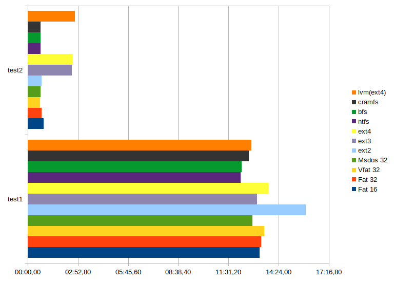

# File system testing

- Select 3 (or more) file systems, choose a verification method and find the best one.

<table class="tg"><thead>
  <tr>
    <th class="tg-0lax"></th>
    <th class="tg-cly1">Fat 16</th>
    <th class="tg-cly1">Fat 32</th>
    <th class="tg-cly1">Vfat 32</th>
    <th class="tg-cly1">Msdos 32</th>
    <th class="tg-cly1">ext2</th>
    <th class="tg-cly1">ext3</th>
    <th class="tg-cly1">ext4</th>
    <th class="tg-cly1">ntfs</th>
    <th class="tg-cly1">bfs</th>
    <th class="tg-cly1">cramfs</th>
    <th class="tg-cly1">lvm(ext4)</th>
  </tr></thead>
<tbody>
  <tr>
    <td class="tg-cly1">test1</td>
    <td class="tg-cly1">13:17.56</td>
    <td class="tg-cly1">13:23.26</td>
    <td class="tg-cly1">13:33.30</td>
    <td class="tg-cly1">12:53.03</td>
    <td class="tg-cly1">15:56.80</td>
    <td class="tg-cly1">13:09.39</td>
    <td class="tg-cly1">13:48.21</td>
    <td class="tg-cly1">12:13.30</td>
    <td class="tg-cly1">12:16.76</td>
    <td class="tg-cly1">12:40.77</td>
    <td class="tg-cly1">12:50.42</td>
  </tr>
  <tr>
    <td class="tg-cly1">test2</td>
    <td class="tg-cly1">00:55.71</td>
    <td class="tg-cly1">00:48.01</td>
    <td class="tg-cly1">00:43.06</td>
    <td class="tg-cly1">00:43.80</td>
    <td class="tg-cly1">00:48.01</td>
    <td class="tg-cly1">02:32.91</td>
    <td class="tg-cly1">02:36.09</td>
    <td class="tg-cly1">00:44.35</td>
    <td class="tg-cly1">00:45.15</td>
    <td class="tg-cly1">00:44.05</td>
    <td class="tg-cly1">02:42.15</td>
  </tr>
</tbody></table>

All tests were performed on a 4 GB flash drive. From the tests performed, it is clear that all file systems operate at more or less the same speed, except for ext… in the write test, with a slow drive such as Toshiba TransMemory USB 2.0. It can also be concluded that the lvm array has almost no effect on transfer speeds.
