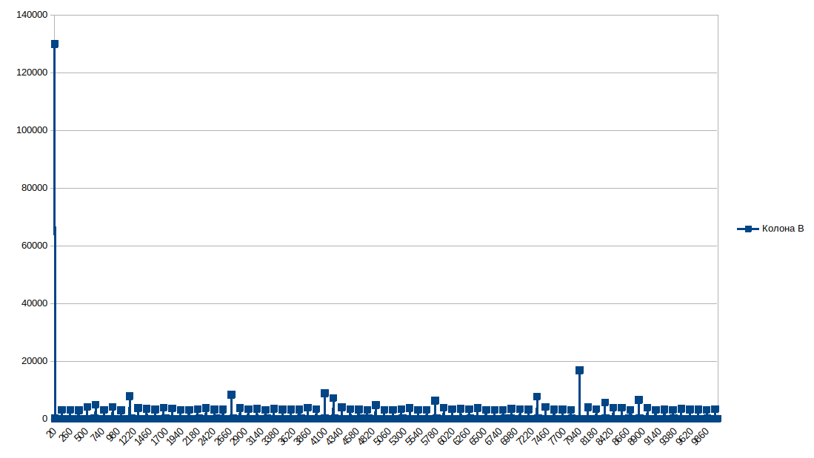
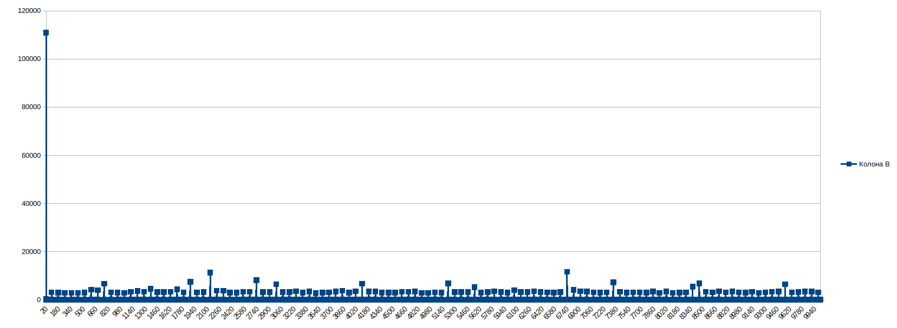
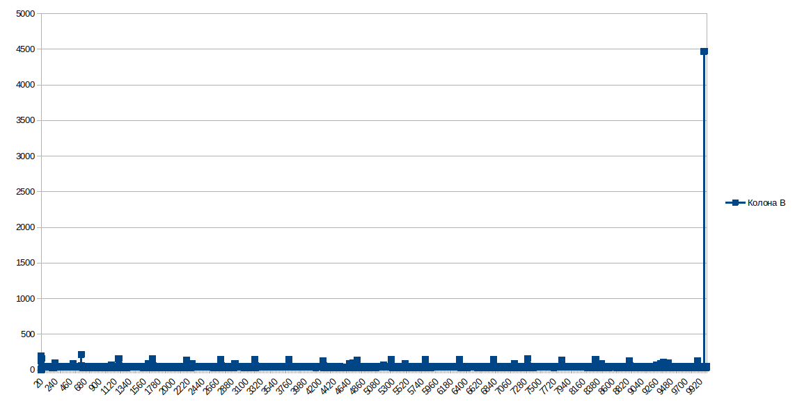
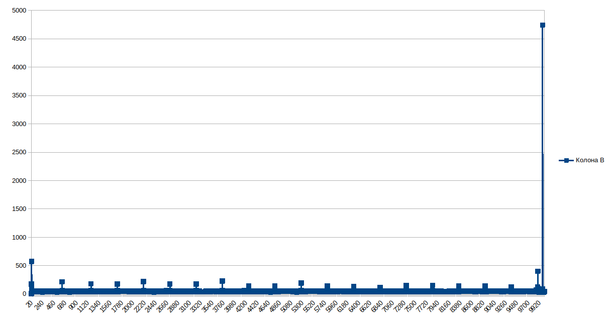

# malloc() function

- Test the malloc/free function and plot a graph of the allocation time versus the size of the requested memory.

Memory allocation 16 bytes

Memory allocation 32 bytes

Allocate memory 16 bytes and free it

Allocate memory 16 bytes and free in reverse order

## Variant 2
htop testing command
LD_PRELOAD=./mtrace.so htop 2> memlog_free.txt

hexsearch.py from memlog_free.txt search for addresses that occur an odd number of times

Example of a leak
malloc(5) = 0x55d1bc26c2a0 time=88750
free(0x55d1bc26c2a0) time=386
malloc(12) = 0x55d1bc26c2a0 time=106

---
Malloc is a universal tool for allocating memory and therefore it does not work optimally for special cases. In the 2 variant, we connected the library before the htop program, which collects information about which addresses are allocated and how long it takes to allocate memory. After processing by the python program, we can see all addresses allocated/freed an odd number of times. This means that the program is “leaking” or even freeing memory twice, and this is dangerous.