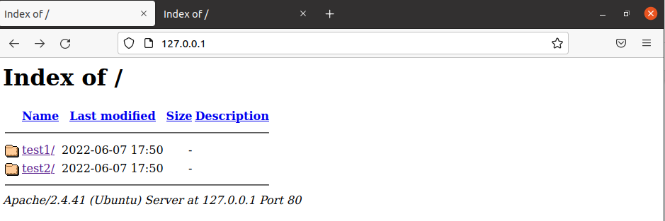
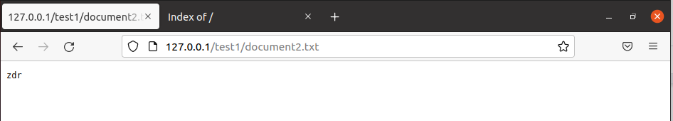
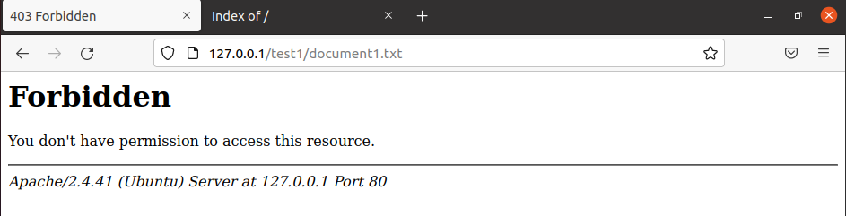
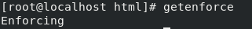
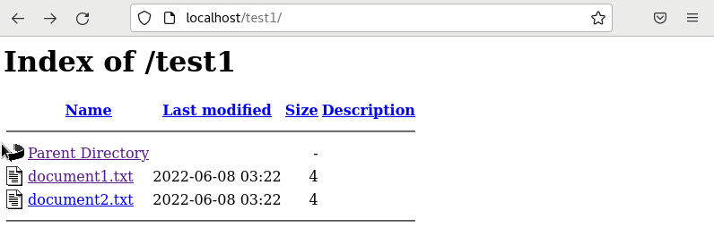
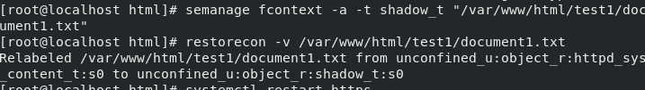
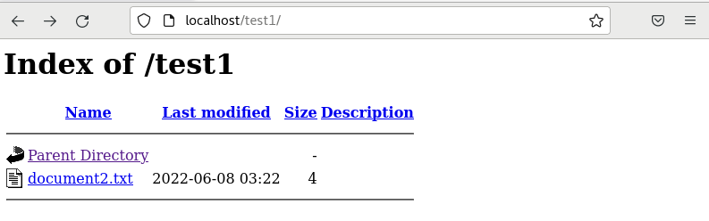
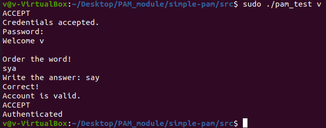
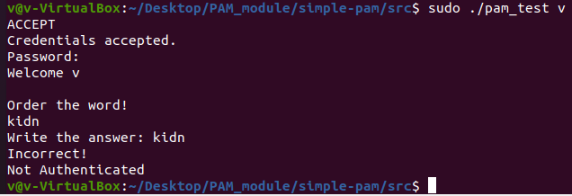
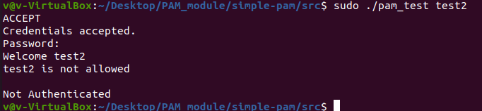

# Lab 8

- Configure Apparmor to monitor a complex application and demonstrate its operation with limited rights (window application or web server)
- Configure Selinux in mandatory access mode (CentOS, etc.) and demonstrate its operation in a two-tier model.
- Come up with and write your own PAM module (complex authorization of actions)

## Apparmour

`apache2 configuration`
```
/var/www/html/
├── [drwxr-xr-x root 	root	]  test1
│   ├── [-rw-r--r-- root 	root	]  document1.txt
│   └── [-rw-r--r-- root 	root	]  document2.txt
└── [drwxr-xr-x root 	root	]  test2
	├── [-rw-r--r-- root 	root	]  document1.txt
	└── [-rw-r--r-- root 	root	]  document2.txt
```



```bash
aa-autodep apache2
aa-genprof apache2
systemctl enable apache2
```
`cat /etc/apparmor.d/usr.sbin.apache2`
```
# Last Modified: Tue Jun  7 17:56:21 2022
#include <tunables/global>

/usr/sbin/apache2 {
  #include <abstractions/base>
  #include <abstractions/dovecot-common>
  #include <abstractions/nameservice>
  #include <abstractions/nis>
  #include <abstractions/postfix-common>
  #include <abstractions/web-data>

  signal send set=term peer=unconfined,

  /usr/sbin/apache2 mr,
  /var/log/apache2/access.log w,
  owner /etc/apache2/apache2.conf r,
  owner /etc/apache2/conf-available/charset.conf r,
  owner /etc/apache2/conf-available/localized-error-pages.conf r,
  owner /etc/apache2/conf-available/other-vhosts-access-log.conf r,
  owner /etc/apache2/conf-available/security.conf r,
  owner /etc/apache2/conf-available/serve-cgi-bin.conf r,
  owner /etc/apache2/conf-enabled/ r,
  owner /etc/apache2/mods-available/access_compat.load r,
  owner /etc/apache2/mods-available/alias.conf r,
  owner /etc/apache2/mods-available/alias.load r,
  owner /etc/apache2/mods-available/auth_basic.load r,
  owner /etc/apache2/mods-available/authn_core.load r,
  owner /etc/apache2/mods-available/authn_file.load r,
  owner /etc/apache2/mods-available/authz_core.load r,
  owner /etc/apache2/mods-available/authz_host.load r,
  owner /etc/apache2/mods-available/authz_user.load r,
  owner /etc/apache2/mods-available/autoindex.conf r,
  owner /etc/apache2/mods-available/autoindex.load r,
  owner /etc/apache2/mods-available/deflate.conf r,
  owner /etc/apache2/mods-available/deflate.load r,
  owner /etc/apache2/mods-available/dir.conf r,
  owner /etc/apache2/mods-available/dir.load r,
  owner /etc/apache2/mods-available/env.load r,
  owner /etc/apache2/mods-available/filter.load r,
  owner /etc/apache2/mods-available/mime.conf r,
  owner /etc/apache2/mods-available/mime.load r,
  owner /etc/apache2/mods-available/mpm_event.conf r,
  owner /etc/apache2/mods-available/mpm_event.load r,
  owner /etc/apache2/mods-available/negotiation.conf r,
  owner /etc/apache2/mods-available/negotiation.load r,
  owner /etc/apache2/mods-available/reqtimeout.conf r,
  owner /etc/apache2/mods-available/reqtimeout.load r,
  owner /etc/apache2/mods-available/setenvif.conf r,
  owner /etc/apache2/mods-available/setenvif.load r,
  owner /etc/apache2/mods-available/status.conf r,
  owner /etc/apache2/mods-available/status.load r,
  owner /etc/apache2/mods-enabled/ r,
  owner /etc/apache2/ports.conf r,
  owner /etc/apache2/sites-available/000-default.conf r,
  owner /etc/apache2/sites-enabled/ r,
  owner /etc/mime.types r,
  owner /run/apache2/apache2.pid rw,
  owner /var/log/apache2/error.log w,
  owner /var/log/apache2/other_vhosts_access.log w,

deny /var/www/html/test1/document1.txt r,

  ^DEFAULT_URI {
  }

  ^HANDLING_UNTRUSTED_INPUT {
  }
}
```


Via deny /var/www/html/test1/document1.txt r, reading of this file is prohibited

## SELinux



```bash
yum install policycoreutils-python
```

`ls -Z ./test*`
```
./test1:
unconfined_u:object_r:httpd_sys_content_t:s0 document1.txt
unconfined_u:object_r:httpd_sys_content_t:s0 document2.txt

./test2:
unconfined_u:object_r:httpd_sys_content_t:s0 document1.txt
unconfined_u:object_r:httpd_sys_content_t:s0 document2.txt
```



`ls -Zl ./test*`
```
./test1:
общо 8
-rw-r--r--. 1 root root unconfined_u:object_r:shadow_t:s0        	4  8 юни  3,22 document1.txt
-rw-r--r--. 1 root root unconfined_u:object_r:httpd_sys_content_t:s0 4  8 юни  3,22 document2.txt

./test2:
общо 8
-rw-r--r--. 1 root root unconfined_u:object_r:httpd_sys_content_t:s0 4  8 юни  3,22 document1.txt
-rw-r--r--. 1 root root unconfined_u:object_r:httpd_sys_content_t:s0 4  8 юни  3,22 document2.txt
```


When the file type was changed to shadow_t, apache2 stopped having access to the file despite being the owner of the file. The shadow_t type is created for /etc/shadow and the process needs to have the passwd_t label to read and write to the file.

## PAM module

Pam module that requires ordering a word given in a random order from the top 200 most used English words. In addition, it does not allow access to a user named test2.

`cat /var/lib/pam/words`
```
able
about
again
air
all
always
and
answer
any
around
ask
…
```

`/etc/pam.d/common-auth`
```
# here are the per-package modules (the "Primary" block)
auth	[success=1 default=ignore]  	pam_unix.so nullok
# here's the fallback if no module succeeds
auth	requisite                   	pam_deny.so
# prime the stack with a positive return value if there isn't one already;
# this avoids us returning an error just because nothing sets a success code
# since the modules above will each just jump around
auth	required                    	pam_permit.so
# and here are more per-package modules (the "Additional" block)
auth	optional                    	pam_cap.so
# end of pam-auth-update config
#my test pam
auth required mypam.so
account sufficient mypam.so
```



