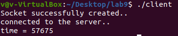
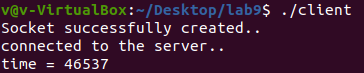
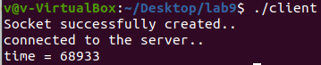
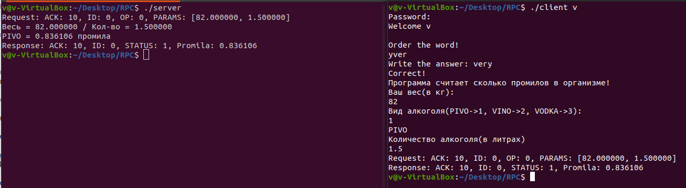

- Test tcp sockets with different setsockopt settings
- Implement rpc program for linux with authentication support (rpcinfo,rpcbind)

## TCP Client/Server



The Nagle algorithm is a means of improving the efficiency of TCP/IP networks by reducing the number of packets that need to be sent over the network. It was devised by John Nagle while working at Ford Aerospace and published in 1984 in response to a Request for Comments titled "Congestion Control in IP/TCP Networks" (see RFC 896). In the RFC, it describes the "small packet problem", where an application repeatedly transmits data in small batches, often as small as 1 byte. Since TCP packets have a 40-byte header (20 bytes for TCP, 20 bytes for IPv4), this results in a 41-byte packet with 1 byte of payload, a huge overhead. Disabling Nagle's algorithm is done by the TCP_NODELAY option in the setsockopt() function.

### Add this code to the client.

```c
#include <netinet/tcp.h>
int yes = 1;
int result = setsockopt(sockfd,
                    	IPPROTO_TCP,
                    	TCP_NODELAY,
                    	(char *) &yes,
                    	sizeof(int));	// 1 - on, 0 - off
 if (result < 0)
    printf("ERROR TCP_NODELAY\n");
```


### Other setting:

```c
   const int on = 1;
if (setsockopt(sockfd, SOL_SOCKET, SO_KEEPALIVE, &on, sizeof(on))){
    	printf("ERROR\n");
}
const int flags = 10;
if (setsockopt(sockfd, IPPROTO_TCP, TCP_KEEPIDLE, &flags, sizeof(flags))){
    	printf("ERROR\n");
}
```


## RPC program
RPC program with pam authentication. The client sends a request to the server with parameters and asks it to calculate the number of ppm of alcohol in the body.

